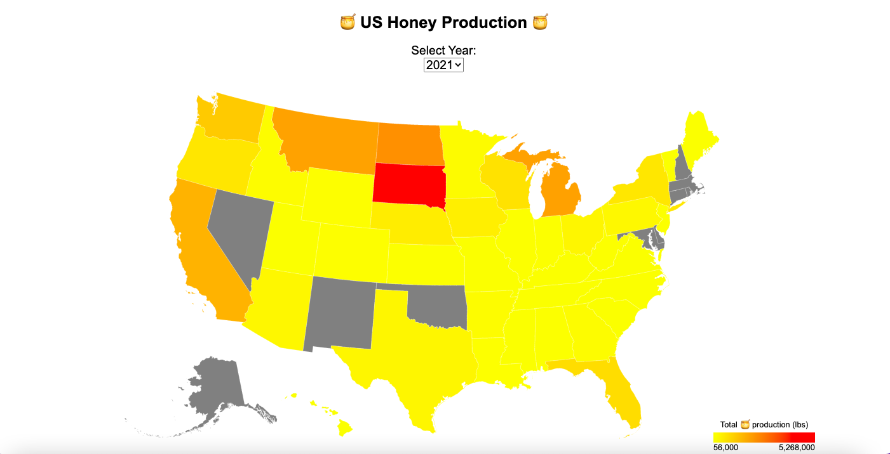

# US Honey Production Visualization

This project showcases a data visualization that presents the honey production, demand, and supply across different states of America from 1995 - 2021. The visualization allows users to select a year and view statistics per state on a map, providing valuable insights into honey production trends and patterns.

## Questions Answered by the Visualization

1. Which states in the United States have the highest honey production?
By interacting with the visualization and selecting a specific year, users can identify the states that contribute the most to honey production. The visualization highlights the top-producing states, enabling a comparison of their production levels.

2. How has honey production changed over the years for different states? Are there any states experiencing a decline in honey production?
The visualization allows users to observe the changes in honey production across different states over time. By selecting different years, users can gain insights into the trends and patterns of honey production in specific states, identifying whether there have been significant fluctuations or consistent growth.

3. Which states have the highest yield per honey bee colony?
By analyzing the visualization and selecting a specific year, users can identify the states that have the highest yield per honey bee colony. This information provides insights into the productivity and efficiency of honey production in different states.

4. How does the average price of honey vary across states? What is the total value of honey production in different states?
By selecting a specific year, users can explore the average price of honey and the total value of honey production in different states. This information provides insights into the economic significance of honey production in various regions and can be useful for understanding market dynamics.

## Features

1. Utilizes interactive data visualization techniques.
2. Presents honey production statistics on a map for easy comparison.
3. Allows users to select specific years to analyze trends.
4. Provides a clear visual representation of honey production levels per state.
5. Tooltip provides in depth stats when you hover over a particular state.

## How to Run

To explore the honey production visualization, follow these steps:

1. Clone the repository to your local machine.
2. Open the project files in your preferred web browser.
3. Interact with the visualization by selecting a year to view honey production statistics per state.

[Data Source](https://www.kaggle.com/datasets/mohitpoudel/us-honey-production-19952021?resource=download)
